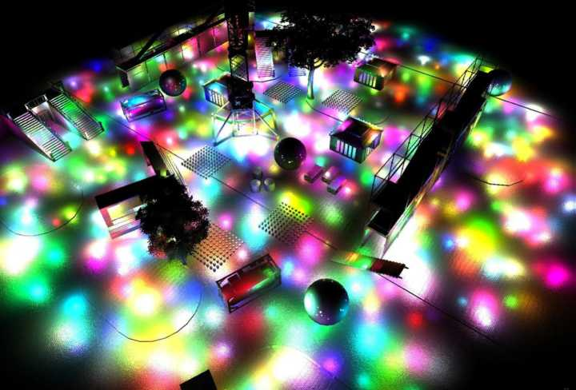
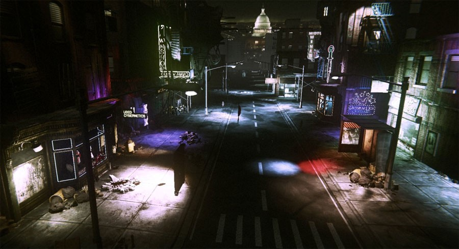
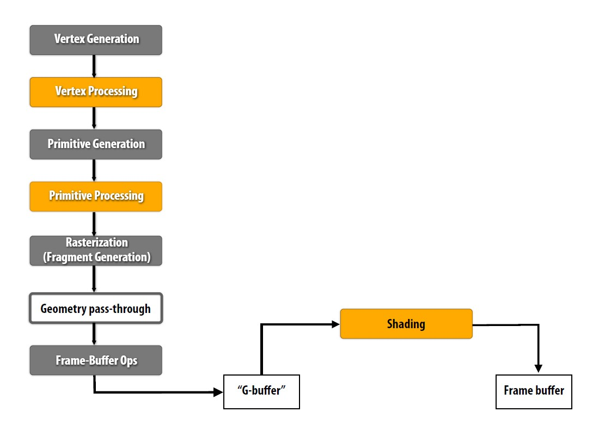
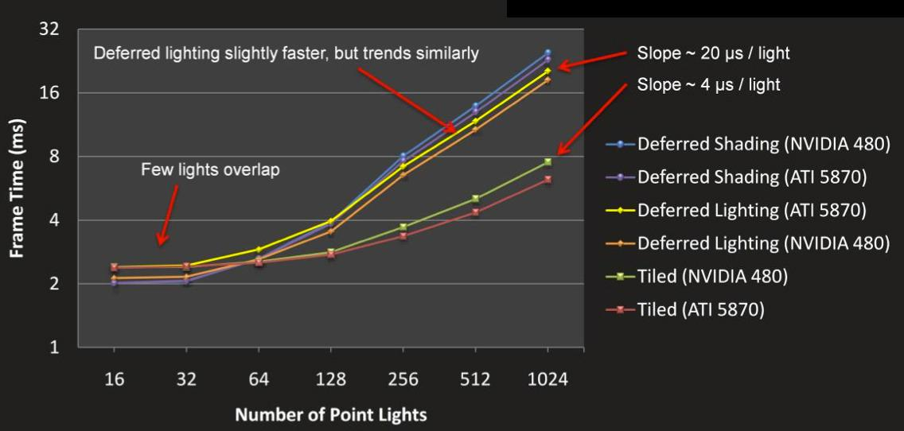
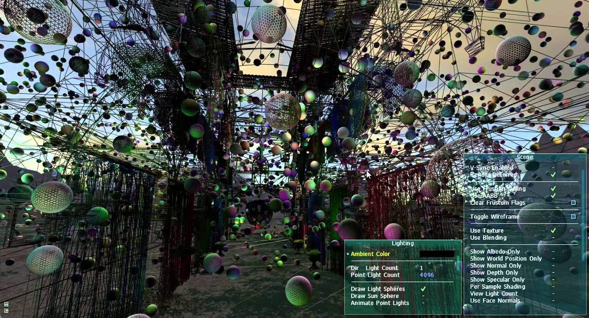
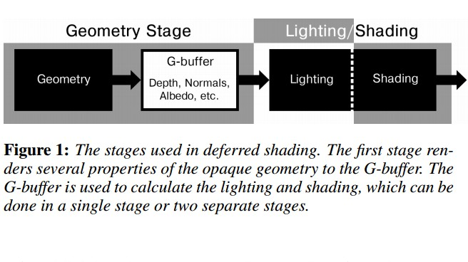
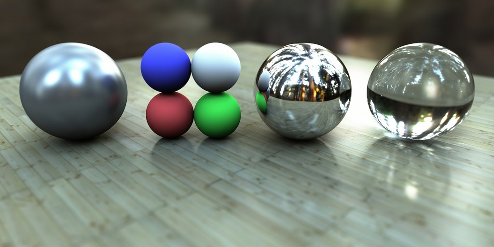

# 【《Real-Time Rendering 3rd》 提炼总结】(七) 第七章续 · 延迟渲染(Deferred Rendering)的前生今世

题图为基于Deferred Rendering技术的渲染效果图。

在计算机图形学中，延迟渲染( Deferred Rendering) ，即延迟着色（Deferred
Shading），是将着色计算延迟到深度测试之后进行处理的一种渲染方法。延迟着色技术的最大的优势就是将光源的数目和场景中物体的数目在复杂度层面上完全分开，能够在渲染拥有成百上千光源的场景的同时依然保持很高的帧率，给我们渲染拥有大量光源的场景提供了很多可能性。

图1 使用Deferred Rendering方法渲染的多光源场景

在《Real-Time Rendering 3rd》（实时渲染图形学第三版）的第七章“Advanced Shading ·
高级着色”中，除了上篇文章中我们聊到的BRDF，还有Deferred
Shading（延迟着色）这个重要概念我们没有聊到。这篇文章，就主要和大家一起聊一聊Deferred
Shading和它的“前生今世”，以及文末简单提一提第八章“区域和环境光照 Area and
Environmental Lighting”中的Environment
Mapping（环境映射）相关的内容。下篇文章，预计直接开始全局光照（Global
Illumination）的内容。

简而言之，通过阅读这篇文章，你将对以下要点有所了解：

-   延迟着色/延迟渲染的概念 Deferred Shading / Deferred Rendering

-   几何缓冲区 G-buffer

-   延迟渲染的渲染过程

-   延迟渲染 vs 正向渲染

-   延迟渲染的优缺点

-   延迟光照 Light Pre-Pass / Deferred Lighting

-   分块延迟渲染 Tile-Based Deferred Rendering

-   延迟渲染 vs 延迟光照

-   实时渲染中常见的Rendering Path总结

-   环境映射 Environment Mapping

一、延迟渲染 Deferred Rendering
===============================

延迟渲染( Deferred Rendering)，即延迟着色（Deferred
Shading），顾名思义，是将着色计算延后进行处理的一种渲染方法，在2004年的GDC上被正式提出[http://www.tenacioussoftware.com/gdc_2004_deferred_shading.ppt](http://link.zhihu.com/?target=http%3A//www.tenacioussoftware.com/gdc_2004_deferred_shading.ppt)。

我们知道，正向渲染(Forward Rendering)，或称正向着色(Forward
Shading)，是渲染物体的一种非常直接的方式，在场景中我们根据所有光源照亮一个物体，之后再渲染下一个物体，以此类推。

传统的正向渲染思路是，先进行着色，再进行深度测试。其的主要缺点就是光照计算跟场景复杂度和光源个数有很大关系。假设有n个物体，m个光源，且每个每个物体受所有光源的影响，那么复杂度就是O(m\*n)。

正向渲染简单直接，也很容易实现，但是同时它对程序性能的影响也很大，因为对每一个需要渲染的物体，程序都要对每个光源下每一个需要渲染的片段进行迭代，如果旧的片段完全被一些新的片段覆盖，最终无需显示出来，那么其着色计算花费的时间就完全浪费掉了。

而延迟渲染的提出，就是为了解决上述问题而诞生了（尤其是在场景中存在大量光源的情况下）。延迟着色给我们优化拥有大量光源的场景提供了很多可能性，因为它能够在渲染拥有成百上千光源的场景的同时还能够保持能让人接受的帧率。下面这张图展示了一个基于延迟着色渲染出的场景，这个场景中包含了1000个点光源，对于目前的硬件设备而言，用传统的正向渲染来实现几乎是不可能的。

图2 基于Deferred Rendering 渲染的含1000个点光源的场景 [J. Andersson, SIGGRAPH
2009 Beyond Programmable shading course talk] \@ Frostbite 2引擎

可以将延迟渲染( Deferred
Rendering)理解为先将所有物体都先绘制到屏幕空间的缓冲（即G-buffer，Geometric
Buffer，几何缓冲区）中，再逐光源对该缓冲进行着色的过程，从而避免了因计算被深度测试丢弃的⽚元的着色而产⽣的不必要的开销。也就是说延迟渲染基本思想是，先执行深度测试，再进行着色计算，将本来在物空
间（三维空间）进行光照计算放到了像空间（二维空间）进行处理。

对应于正向渲染O(m\*n)的 复杂度，经典的延迟渲染复杂度为O(n+m)。

图3 Unreal Engine 3中实现的Deferred Shading \@GDC 2011

Jimmikaelkael在2016年12月24日发了一条推文（[https://twitter.com/jimmikaelkael/status/812631802242273280](http://link.zhihu.com/?target=https%3A//twitter.com/jimmikaelkael/status/812631802242273280)），分享了一组在Unity3D中基于Deferred
Shading渲染的SpeedTree场景，非常逼真：

图4 SpeedTree deferred shading with translucency \@Unity3D引擎 by jimmikaelkael

图5 SpeedTree deferred shading with translucency \@Unity3D引擎 by jimmikaelkael

图6 SpeedTree deferred shading with translucency \@Unity3D引擎 by jimmikaelkael

图7 SpeedTree deferred shading with translucency \@Unity3D引擎 by jimmikaelkael

延迟着色中一个非常重要的概念就是G-Buffer，下面先聊一下G-Buffer。

二、几何缓冲区 G-buffer
=======================

G-Buffer，全称Geometric Buffer
，译作几何缓冲区，它主要用于存储每个像素对应的位置（Position），法线（Normal），漫反射颜色（Diffuse
Color）以及其他有用材质参数。根据这些信息，就可以在像空间（二维空间）中对每个像素进行光照处理。

图8 一个典型的G-buffer layout。Source: W. Engel, “Light-Prepass Renderer Mark
III” \@SIGGRAPH 2009Talks

下图是一帧中G-buffer中存储的内容：

图9 G-buffer存储的信息

三、延迟渲染的过程分析
======================

可以将延迟渲染理解为两个Pass的过程：

1、几何处理阶段(Geometry
Pass)。这个阶段中，我们获取对象的各种几何信息，并将第二步所需的各种数据储存（也就是渲染）到多个G-buffer中；

2、光照处理阶段(Lighting
Pass)。在这个pass中，我们只需渲染出一个屏幕大小的二维矩形，使用第一步在G-buffer中存储的数据对此矩阵的每一个片段计算场景的光照；光照计算的过程还是和正向渲染以前一样，只是现在我们需要从对应的G-buffer而不是顶点着色器(和一些uniform变量)那里获取输入变量了。

下面这幅图片很好地展示了延迟着色的整个过程：

图10 延迟着色的过程

延迟渲染方法一个很大的好处就是能保证在G-buffer中的片段和在屏幕上呈现的像素所包含的片段信息是一样的，因为深度测试已经最终将这里的片段信息作为最顶层的片段。这样保证了对于在光照处理阶段中处理的每一个像素都只处理一次，所以我们能够省下很多无用的渲染调用。除此之外，延迟渲染还允许我们做更多的优化，从而渲染更多的光源。

在几何处理阶段中填充G-buffer非常高效，因为我们直接储存位置，颜色，法线等对象信息到帧缓冲中，这个过程几乎不消耗处理时间。

而在此基础上使用多渲染目标(Multiple Render Targets,
MRT)技术，我们可以在一个Pass之内完成所有渲染工作。

总结一下，典型的Deferred Rendering 的渲染流程有两步：

1. 几何处理阶段：渲染所有的几何/颜色数据到G-buffer

2. 光照处理阶段：使用G-buffer计算场景的光照。

四、延迟渲染的伪代码
====================

为了便于理解，这里贴出一些各种描述版本的延迟渲染算法的伪代码：

1、通用版本的延迟着色算法伪代码：

    For each object:

	Render to multiple targets

	For each light:

	Apply light as a 2D postprocess

2、一个通用版本的deferred shading过程描述：

	“Standard” deferred shading is a 2-stage process:
	
	(1) draw (opaque) geometry storing its attributes (i.e. position as depth,
	normals, albedo color, specular color and other material properties) in a number
	of full screen buffers (typically 3 or 4)
	
	(2) for each light source, draw its volume and accumulate lit surface color
	into final render target

3、两个Pass的延迟着色算法伪代码：

	Two-pass deferred shading algorithm
	Pass 1: geometry pass
	- Write visible geometry information to G-buffer
	Pass 2: shading pass
	For each G-buffer sample, compute shading
	- Read G-buffer data for current sample
	- Accumulate contribution of all lights
	- Output final surface color

4、多光源的延迟渲染的伪代码：

	Many-light deferred shading algorithm
	For each light:
	-Generate/bind shadow/environment maps
	-Compute light’s contribution for each G-buffer sample:
	For each G-buffer sample
	-Load G-buffer data
	-Evaluate light contribution (may be zero)
	-Accumulate contribution into frame-buffer

可以将这里的多光源计算过程理解为，对每个光源创建一个屏幕空间包围矩形，然后用光照shader渲染这个矩形。

五、延迟渲染 vs 正向渲染
========================

这边对正向渲染和延迟渲染的特性做一个对照列举：

5.1 正向渲染
------------

-   正向渲染（Forward Rendering），先执行着色计算，再执行深度测试。

-   正向渲染渲染n个物体在m个光源下的着色，复杂度为O(n\*m)次。

-   Forward
    Rendering，光源数量对计算复杂度影响巨大，所以比较适合户外这种光源较少的场景。

-   Forward Rendering的核心伪代码可以表示为：

    	For each light:
			For each object affected by the light: 
				framebuffer += object * light

Forward Rendering的管线流程如下：

图11 正向渲染（Forward Rendering）管线流程

5.2 延迟渲染
------------

-   延迟渲染( Deferred Rendering)，先执行深度测试，再执行着色计算。

-   延迟渲染渲染n个物体在m个光源下的着色，复杂度为O(n+m)次。

-   Deferred Rendering
    的最大的优势就是将光源的数目和场景中物体的数目在复杂度层面上完全分开。也就是说场景中不管是一个三角形还是一百万个三角形，最后的复杂度不会随
    光源数目变化而产生巨大变化。

-   Deferred
    Rendering的核心伪代码可以表示如下，上文已经贴出过，这边再次贴出，方便对比：

    For each object:
    	Render to multiple targets 
	For each light:
    	Apply light as a 2D postprocess

Deferred Rendering的管线流程如下：

图12 延迟渲染( Deferred Rendering)管线流程

六、延迟渲染的优缺点分析
========================

这里列举一下经典版本的延迟渲染的优缺点。

6.1 延迟渲染的优点
------------------

Deferred Rendering
的最大的优势就是将光源的数目和场景中物体的数目在复杂度层面上完全分开。也就是说场景中不管是一个三角形还是一百万个三角形，最后的复杂度不会随光源数目变化而产生巨大变化。

一些要点：

-   复杂度仅O(n+m)。

-   只渲染可见的像素，节省计算量。

-   用更少的shader。

-   对后处理支持良好。

-   在大量光源的场景优势尤其明显。

6.2 延迟渲染的缺点
------------------

一些要点：

-   内存开销较大。

-   读写G-buffer的内存带宽用量是性能瓶颈。

-   对透明物体的渲染存在问题。在这点上需要结合正向渲染进行渲染。

-   对多重采样抗锯齿（MultiSampling Anti-Aliasing,
    MSAA）的支持不友好，主要因为需开启MRT。

七、延迟渲染的改进
==================

针对延迟渲染上述提到的缺点，下面简单列举一些降低 Deferred Rendering
存取带宽的改进方案。最简单也是最容易想到的就是将存取的 G-Buffer
数据结构最小化，这也就衍生出了 Light Pre-Pass（即Deferred Lighting）
方法。另一种方式是将多个光照组成一组，然后一起处理，这种方法衍生了 Tile-Based
Deferred Rendering。

也就是说，常见的两种Deferred Rendering的改进是：

-   延迟光照 Light Pre-Pass（即Deferred Lighting）

-   分块延迟渲染 Tile-BasedDeferred Rendering

下面分别进行说明。

八、延迟光照 LightPre-Pass / Deferred Lighting
==============================================

Light Pre-Pass即Deferred Lighting（延迟光照），旨在减少传统Defferred
Rendering使用G-buffer 时占用的过多开销（reduce G-buffer overhead），最早由
Wolfgang
Engel于2008年在他的博客([http://diaryofagraphicsprogrammer.blogspot.com/2008/03/light-pre-pass-renderer.html](http://link.zhihu.com/?target=http%3A//diaryofagraphicsprogrammer.blogspot.com/2008/03/light-pre-pass-renderer.html))中提到。

延迟光照的具体的思路是：

1、渲染场景中不透明（opaque ）的几何体。将法线向量n和镜面扩展因子（specular
spread factor）m 写入缓冲区。这个n/m-buffer 缓冲区是一个类似
G-Buffer的缓冲区，但包含的信息更少，更轻量，适合于单个输出颜色缓冲区，因此不需要MRT支持。

2、渲染光照。计算漫反射和镜面着色方程，并将结果写入不同的漫反射和镜面反射累积缓冲区。这个过程可以在一个单独的pass中完成（使用MRT），或者用两个单独的pass。环境光照明可以在这个阶段使用一个
full-screen pass进行计算。

3、对场景中的不透明几何体进行第二次渲染。从纹理中读取漫反射和镜面反射值，对前面步骤中漫反射和镜面反射累积缓冲区的值进行调制，并将最终结果写入最终的颜色缓冲区。若在上一阶段没有处理环境光照明，则在此阶段应用环境光照明。

4、使用非延迟着色方法渲染半透明几何体。

具体的流程图可以展示如下：

图13 Deferred Lighting流程图

相对于传统的 Deferred Render，使用 Light Pre-Pass 可以对每个不同的几何体使用不同
的 shader 进行渲染，所以每个物体的 material properties 将有更多变化。

这里我们可以看出对于传统的 Deferred
Render，它的第二步是遍历每个光源，这样就增加了光源设置的灵活性，而 Light
Pre-Pass第三步使用的其实是 forward rendering，所以可以对每mesh
设置其材质，这两者是相辅相成的，有利有弊。

另一个 Light Pre-Pass 的优点是在使用 MSAA 上很有利。虽然并不是 100%使用上了
MSAA（除非使用 DX10/11 的特性），但是由于使用了Z 值和 Normal
值，就可以很容易找到边缘，并进行采样。

九、分块延迟渲染 Tile-BasedDeferred Rendering
=============================================

作为传统Defferred Rendering的另一种主要改进，分块延迟渲染（Tile-Based Deferred
Rendering，TBDR）旨在合理分摊开销（amortize overhead），自SIGGRAPH
2010上提出以来逐渐为业界所了解。

实验数据表明TBDR在大量光源存在的情况下明显优于上文提到的Light Pre-Pass。

我们知道，延迟渲染的瓶颈在于读写
G-buffer，在大量光源下，具体瓶颈将位于每个光源对
G-buffer的读取及与颜色缓冲区（color
buffer）混合。这里的问题是，每个光源，即使它们的影响范围在屏幕空间上有重疉，因为每个光源是在不同的绘制中进行，所以会重复读取G-buffer中相同位置的数据，计算后以相加混合方式写入颜色缓冲。光源越多，内存带宽用量越大。

而分块延迟渲染的主要思想则是把屏幕分拆成细小的栅格，例如每 32 × 32
象素作为一个分块（tile）。然后，计算每个分块会受到哪些光源影响，把那些光源的索引储存在分块的光源列表里。最后，逐个分块进行着色，对每像素读取
G-buffer
和光源列表及相关的光源信息。因此，G-buffer的数据只会被读取1次且仅1次，写入 color
buffer也是1次且仅1次，大幅降低内存带宽用量。不过，这种方法需要计算光源会影响哪些分块，这个计算又称为光源剔除（light
culling），可以在 CPU 或 GPU（通常以 compute shader
实现）中进行。用GPU计算的好处是，GPU 计算这类工作比 CPU 更快，也减少 CPU／GPU
数据传输。而且，可以计算每个分块的深度范围（depth range），作更有效的剔除。

图14 Tile-Based Deferred Rendering 图示 \@GDC2011，SPU-based deferred shading
for Battlefield 3 onPlaystation 3.

也就是说，TBDR 主要思想就是将屏幕分成一个个小块 tile。然后根据这些 Depth
求得每个 tile 的 bounding box。对每个 tile 的 bounding box 和 light
进行求交，这样就得到了对该 tile 有作用 的 light
的序列。最后根据得到的序列计算所在 tile 的光照效果。

对比 Deferred Rendering，之前是对每个光源求取其作用区域 light
volume，然后决定其作用的的 pixel，也就是说每个光源要求取一次。而使用
TBDR，只要遍历每个 pixel，让其所属 tile 与光线求交，来计算作用其上的
light，并利用 G-Buffer 进行 Shading。一方面这样做减少
了所需考虑的光源个数，另一方面与传统的 Deferred Rendering
相比，减少了存取的带宽。

图15 在1920x1080分辨率下，Tile-Based vs. 传统 deferred shading

图16 使用Tile-Based Deferred Rendering思路渲染的场景，场景含4096个点光源

十、延迟渲染 vs 延迟光照
========================

关于延迟着色和延迟光照，经常会被弄混，这边简单区分一下。

-   延迟渲染（Deferred Rendering）又称延迟着色（Deferred
    Shading），在2004年的GDC上被提出。

-   延迟光照（Deferred Lighting）又称Light
    Pre-Pass，是延迟着色的一种改进，在2008年被提出。

Deferred Rendering与Deferred Lighting在思想上的主要异同：

-   DeferredShading需要更大的G-Buffer来完成对Deferred阶段的前期准备，而且一般需要硬件有MRT的支持，可以说是硬件要求更高。

-   DeferredLighting需要两个几何体元的绘制过程来来完成整个渲染操作：G-Pass与Shading
    pass。这个既是劣势也是优势：由于Deferred
    Shading中的Deffered阶段是在完全基于G-Buffer的屏幕空间进行，这也导致了物体材质信息的缺失，这样在处理多变的渲染风格时就需要额外的操作；而Deferred
    Lighting却可以在Shading阶段得到物体的材质信息进而使这一问题的处理变得较简单。

-   两种方法的上述操作均是只能完成对不透明物体的渲染，而透明或半透明的物体则需额外的传统Pass来完成。

两者流程图的对比：

图17 Deferred Shading流程图

图18 Deferred Lighting流程图

十一、实时渲染中常见的Rendering Path总结
========================================

这一节对常见实时渲染中常见的几种 Rendering Path进行一个简单小节。

本文目前已经提到的Rendering Path有：

-   正向渲染 （Forward Rendering）

-   延迟渲染 （Deferred Rendering）

-   延迟光照 （Light Pre-Pass / Deferred Lighting）

-   分块延迟渲染（Tile-Based Deferred Rendering）

除此之外，还有如下一些后来提出的Rendering Path比较有趣：

-   Forward+（即Tiled Forward Rendering，分块正向渲染）

-   群组渲染 Clustered Rendering

篇幅原因，这边就不展开了，有兴趣的朋友不妨去查阅相关资料进行了解。

十二、环境映射 Environment Mapping
==================================

最后简单聊一聊《Real-Time Rendering 3rd》第八章“区域和环境光照 Area and
Environmental
Lighting”中的EnvironmentMapping环境映射。下一篇文章，就直接开始提炼第九章“Global
Illumination 全局光照”的内容。

Environment mapping（环境映射），又称Reflection
Mapping（反射映射）,是计算机图形学领域中使用基于图像的光照（Image-Based
Lighting，IBL）技术，用预先计算的纹理图像模拟复杂镜面的一种高效方法。由Blinn 和
Newell 在1976首次提出。

由于是事先准备好的数据，这种实现方法比传统的光线跟踪算法效率更高，但是需要注意的是这种方法是实际反射的一种近似，有时甚至是非常粗糙的近似。这种技术的一个典型的缺点是没有考虑自反射，即无法看到物体反射的物体自身的某一部分。

图19 Image Based Lighting Environment Mapping 环境映射效果图

环境映射的常见类型有：

-   球型环境映射 Sphere Environment Mapping

-   立方体环境映射 Cubic Environment Mapping

-   抛物线环境映射 Parabolic Environment Mapping

环境映射的一些引申：

-   光泽反射环境映射(Glossy Reflections from Environment Maps)

-   基于视角的反射映射(View-Dependent Reflection Maps)

-   辐照度环境映射 (Irradiance Environment Mapping)

另外，推荐一个下载CubeMap资源的站点：

[http://www.humus.name/index.php?page=Textures](http://link.zhihu.com/?target=http%3A//www.humus.name/index.php%3Fpage%3DTextures)

Reference
=========

[1] Lauritzen, Andrew. "Deferredrendering for current and future rendering
pipelines." SIGGRAPH Course:Beyond Programmable Shading (2010): 1-34.

[2] Coffin, Christina. "SPU-based deferredshading for Battlefield 3 on
Playstation 3." Game Developer ConferencePresentation. Vol. 8. 2011.

[3] Lee M. Pre-lighting in Resistance 2[J].GDC San Francisco, 2009.

[4] Valient M. Deferred rendering inKillzone 2[C]//The Develop Conference and
Expo. 2007.

[5]Andersson, Johan. "Directx 11rendering in battlefield 3." Game Developers
Conference. Vol. 2. 2011.

[6] [http://www.cnblogs.com/ghl_carmack/p/4150232.html](http://link.zhihu.com/?target=http%3A//www.cnblogs.com/ghl_carmack/p/4150232.html)

[7] [https://twitter.com/jimmikaelkael/status/812631802242273280](http://link.zhihu.com/?target=https%3A//twitter.com/jimmikaelkael/status/812631802242273280)

[8] [http://www.realtimerendering.com/blog/deferred-lighting-approaches/](http://link.zhihu.com/?target=http%3A//www.realtimerendering.com/blog/deferred-lighting-approaches/)

[9] [http://miloyip.com/2014/many-lights/](http://link.zhihu.com/?target=http%3A//miloyip.com/2014/many-lights/)

[10] [http://www.cnblogs.com/polobymulberry/p/5126892.html](http://link.zhihu.com/?target=http%3A//www.cnblogs.com/polobymulberry/p/5126892.html)

[11] [http://blog.csdn.net/bugrunner/article/details/7436600](http://link.zhihu.com/?target=http%3A//blog.csdn.net/bugrunner/article/details/7436600)

[12] [https://learnopengl-cn.readthedocs.io/zh/latest/05%20Advanced%20Lighting/08%20Deferred%20Shading/](http://link.zhihu.com/?target=https%3A//learnopengl-cn.readthedocs.io/zh/latest/05%2520Advanced%2520Lighting/08%2520Deferred%2520Shading/)

[13] [http://www.cnblogs.com/ghl_carmack/p/4150232.html](http://link.zhihu.com/?target=http%3A//www.cnblogs.com/ghl_carmack/p/4150232.html)

[14] [http://gameangst.com/?p=141](http://link.zhihu.com/?target=http%3A//gameangst.com/%3Fp%3D141)

[15] [https://www.flickr.com/photos/mylaboratory/2332900823/in/photostream/](http://link.zhihu.com/?target=https%3A//www.flickr.com/photos/mylaboratory/2332900823/in/photostream/)

[16] [https://gamedevcoder.wordpress.com/2011/04/11/light-pre-pass-vs-deferred-renderer-part-1/](http://link.zhihu.com/?target=https%3A//gamedevcoder.wordpress.com/2011/04/11/light-pre-pass-vs-deferred-renderer-part-1/)

[17] CMU 15869 lecture 12 Slides：

[http://www.cs.cmu.edu/afs/cs/academic/class/15869-f11/www/lectures/12_deferred_shading.pdf](http://link.zhihu.com/?target=http%3A//www.cs.cmu.edu/afs/cs/academic/class/15869-f11/www/lectures/12_deferred_shading.pdf)

[18] Lauritzen A. Deferred rendering forcurrent and future rendering
pipelines[J]. SIGGRAPH Course: Beyond ProgrammableShading, 2010:
1-34. [https://software.intel.com/sites/default/files/m/d/4/1/d/8/lauritzen_deferred_shading_siggraph_2010.pdf](http://link.zhihu.com/?target=https%3A//software.intel.com/sites/default/files/m/d/4/1/d/8/lauritzen_deferred_shading_siggraph_2010.pdf)

[19] Nguyen, Hubert. GPU Gems 3. Chapter 19. Addison-Wesley Professional, 2007.
